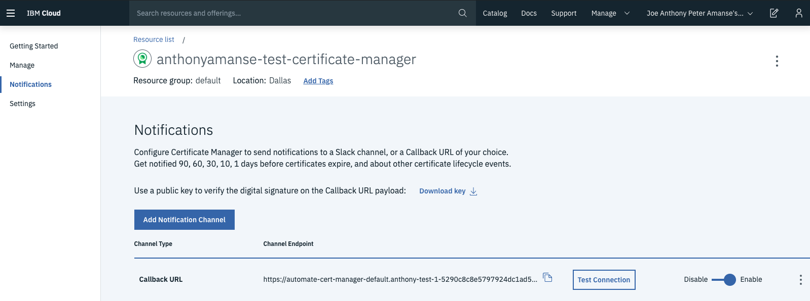
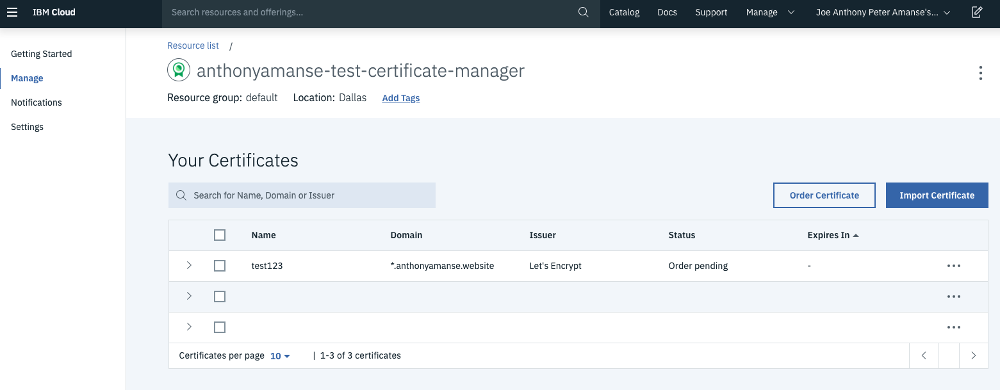

# Renew security certificates automatically for web domains

These days, most applications use HTTPS. To make sure that your users establish secure communication with your application, Secure Sockets Layer (SSL) or Transport Layer Security (TLS) certificates play an integral role. When you use either of these certificates, you enable HTTPS on your applications that use the domain name registered to the certificate. Then all data transmitted to and from the server is encrypted. This approach ensures that no one can easily eavesdrop on your data in motion.

Using certificates also can prevent man-in-the-middle attacks in your communication between the clients of your application users and your servers. Finally, using certificates in your web application ensures that no one tampers with the data that is exchanged. In this digital world, one of the most important security best practices is to make sure your web applications use TLS certificates, an updated, more secure version of SSL.

However, these certificates expire and need to be renewed. Are you looking for a way to ease the renewal of SSL or TLS certificates for your apps? This tutorial walks through how to automate the renewal for you apps, using examples from Red Hat OpenShift on IBM Cloud™.

## Prerequisites
Before you begin, you need [a free IBM Cloud account](https://cloud.ibm.com/registration).

## Estimated time
Completing this tutorial should take about 25 minutes.

## Obtain SSL or TLS certificates through certificate authorities

To obtain SSL or TLS certificates, you must go through a certificate authority (CA). The certificate authority acts as a trusted third party that validates the requester of the certificate is the actual owner and has control over the domain. Operating systems and browsers have a list of CAs that are identified as trusted. The green lock is then visible next to the URL, indicating that the web application is using HTTPS.

1. Use Let’s Encrypt

  [Let's Encrypt](https://letsencrypt.org/) is one of the trusted certificate authorities that provides domain validated certificates that are trusted by most browsers. It uses the Automatic Certificate Management Environment (ACME) protocol for validation, which sends a challenge to verify that you actually control your domain name. This service is widely used because it’s easy and free to get a certificate.

  However, a downside of using this certificate authority is that certificates issued are only good for 90 days. You must go through the process of getting a new certificate. You might face an outage of your application because of expired certificates. Manually requesting certificates can be cumbersome, especially when you need more than one domain.

  An advantage is that you can easily automate this process with the help of Let’s Encrypt’s Certbot or other open source software that integrates with Let’s Encrypt.

2. Using the Certbot client

  One simple way of getting a certificate through Let’s Encrypt is running the Certbot client. You need to run it manually every time you need new certificates, such as when they expire. You can automate this work by writing your own code that runs the Certbot client every 90 days. It’s easier if your DNS provider supports APIs, so you can complete the challenges without having to go through your DNS provider’s website. See [Getting Started documentation for Let’s Encrypt and Certbot](https://letsencrypt.org/getting-started/).

## Automating with Kubernetes Ingress

If you use Kubernetes and its [Ingress](https://kubernetes.io/docs/concepts/services-networking/ingress/#the-ingress-resource) resource, you might already be using SSL or TLS certificates on your Ingress resources. If you want to automate the provisioning and renewing of Let’s Encrypt certificates with your Ingress resource, you can easily deploy [cert-manager](https://github.com/jetstack/cert-manager) in Kubernetes. The Kubernetes add-on cert-manager automates the process of requesting and using certificates in your Ingress resources.

This open source software completes your challenge: you don’t need any manual intervention on your DNS provider or application. After the certificate is issued, the certificate should show up as a Kubernetes secret in your environment. The cert-manager add-on also keeps it up to date, as long as it is running.

## Automating with OpenShift Routes

If you use OpenShift [routes](https://docs.openshift.com/enterprise/3.0/architecture/core_concepts/routes.html), consider using [openshift-acme](https://github.com/tnozicka/openshift-acme), which works similar to cert-manager. It automates provisioning certificates by using routes, which makes it easier to request and attach certificates on your OpenShift routes.

Because both cert-manager and openshift-acme are open source projects, you can take a look at the source code and modify it to fit your needs. Or, you can even contribute back to the respective upstreams.

## Use the Certificate Manager service

IBM Cloud includes a [Certificate Manager](https://cloud.ibm.com/catalog/services/certificate-manager) service that helps you manage and deploy SSL or TLS certificates. The service lets your store your certificates and sends you notifications when your certificates are about to expire. The service also lets you order certificates directly from Let’s Encrypt, which could help your application prevent outages due to expired certificates.

An advantage is you can use available APIs to automate the process of provisioning or renewing your certificates. If you’re already using IBM Cloud [Internet Services](https://cloud.ibm.com/catalog/services/internet-services) as your DNS provider, you can easily order certificates with Let’s Encrypt through the Certificate Manager service. For other DNS providers, you need to set up your own callback URL service to receive the challenge sent by Let’s Encrypt.

The Certificate Manager instance uses the callback URL you set for events such as “Certificate domain validation required” and “Ordered certificate issued.”

## An example of deploying in Red Hat OpenShift on IBM Cloud

OpenShift is one example of where you can deploy your callback service. The following example uses the Source-to-Image strategy of deploying an application in OpenShift. OpenShift directly pulls from a GitHub repo and then builds and deploys it directly in the platform.

The sample application in this section uses Godaddy as its DNS provider because it provides free use of its APIs. Deploying it in OpenShift make sense when you already widely use OpenShift to deploy your applications.

1. To get started deploying, you need to create an IBM Cloud Certificate Manager instance. If your DNS provider is not Godaddy, you need to modify the code to use your DNS provider APIs (modify DNS records such as adding and removing TXT records from your domain).s

2. Clone the [automate-cert-manager](https://github.com/IBM/automate-cert-manager) repo. Get your Certificate Manager CRN from the Certificate Manager dashboard, modify the `openshift-auto-cert.env.template` with your own values, and rename it as `openshift-auto-cert.env`. Your CRN goes in the `ALLOWED_CM` value, as shown in the following screen capture:


Example `openshift-auto-cert.env`:
```bash
GODADDY_KEY=keysample
GODADDY_SECRET=secretsample
GODADDY_DOMAIN=anthonyamanse.space
CM_REGION=us-south
ALLOWED_CM=crn:v1:bluemix:public:cloudcerts:us-south:a/123:123-456-567::
```

3. Now you can deploy the app from the command line with your OpenShift CLI. Make sure you are logged in, and run the following commands:

```bash
oc new-app https://github.com/IBM/automate-cert-manager --env-file=openshift-auto-cert.env
oc expose svc automate-cert-manager
```

4. To check the status of the build and deployment, run `oc get pods` and you should see a result like the following example:

```bash
$ oc get pods

NAME                                READY     STATUS      RESTARTS   AGE
automate-cert-manager-1-build       0/1       Completed   0          4d
automate-cert-manager-1-xs7gm       1/1       Running     0          4d
```

5. You must enable HTTPS with the exposed route for the callback URL to work with Certificate Manager. Edit the route:

```
$ oc edit routes automate-cert-manager
```

6. Add the lines tls:, terminate: edge under the key spec: like the following example (indents are important for a yaml file):

```
spec:
  tls:
    termination: edge
```

7. Get the route.

```
oc get routes
NAME                    HOST/PORT                                                                                                               PATH      SERVICES                PORT               TERMINATION   WILDCARD
automate-cert-manager   automate-cert-manager-default.anthony-test-1-5290c8c8e5797924dc1ad5d1b85b37c0-0001.us-east.containers.appdomain.cloud             automate-cert-manager   8080-tcp           edge          None
```

8. Now you can put your route in the callback URL of your Certificate Manager instance, `https://<your-route>/callback`, as shown in the following screen capture:



9. Try ordering a certificate through the Certificate Manager dashboard. The status should change from `Order Pending` to `Valid`. Then you can download the certificates through the dashboard. You can also add more automation by using the Certificate Manager APIs to fetch the certificates and place them wherever you use them (for example, in your load balancer). The following screen capture shows an example:



## An example of deploying in IBM Cloud Functions

You might prefer to keep costs low and use serverless architecture. You save time because you don’t need to worry about the infrastructure behind your application. This example in this section uses [IBM Cloud Functions](https://cloud.ibm.com/functions) as the serverless platform.

1. Clone the repo you used in the previous section and modify the openwhisk-auto-cert.json.template instead.

2. Deploy it in Cloud Functions:

```
$ ic fn action create callback-gd actions/callback-gd.js -P openwhisk-auto-cert.json --web true
ok: created action callback-gd

$ ic fn action get callback-gd -r
ok: got action callback-gd
https://us-south.functions.cloud.ibm.com/api/v1/web/QWERTY/default/callback-gd
```

3. Use the URL from `ic fn action get callback-gd -r` as your callback URL for your certificate manager instance. Then you can proceed to ordering new certificates like the previous section.

## Summary

With the large amount of data that is transmitted today, it is important to have SSL or TLS certificates in your applications, especially when the users of your application have personal information exchanged. This secure communication makes your users feel more comfortable because of the security HTTPS provides.

Also consider that other certificate authorities issue certificates that expire later than 90 days. They provide other means of validation like organization validation (OV) and extended validation (EV), compared to the domain validation (DV) from Let’s Encrypt.

For your users, ensure that others cannot access their data and check if the apps they use are HTTPS-enabled. If you want to automate your certificate renewal process for your domain, start with the ways described in this tutorial. Let’s Encrypt can quickly issue a certificate without additional costs. Setting up a good automation for your certificates ensures that your app won’t have an outage because of expired certificates. When your DNS provider has APIs, you can automate the completion of the challenge by Let’s Encrypt.

Now that you know how to automate the provisioning and renewal of TLS certificates, you can enable HTTPS on your own web applications to ensure all your users’ data in transit is encrypted. You learned some tools to automate TLS certificates to avoid outages. With the help of tools like Certificate Manager, you can be certain that all your certificates are securely stored.
